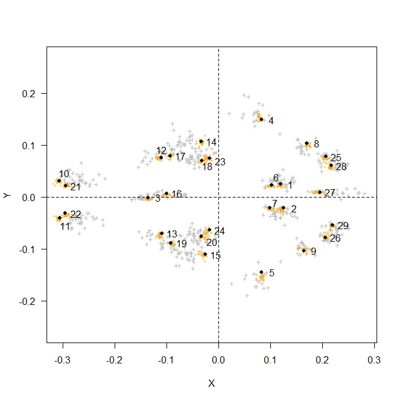

```{r setup, include = FALSE}
knitr::opts_chunk$set(
  collapse = TRUE,
  comment = "#>"
)
```

This vignette aims to explain the methodology applied to obtain the morphological alignment with the Carnivora data set used as an input for MCMCtree v4.9i. This approach can be divided in 5 steps:  

  1. Collect and process morphological data  
  2. Perform Procrustes alignment   
  3. Obtain morphological alignments, `C` and `V`  
  4. Correct `C` for population noise and character correlation  
  5. Generate alignment in MCMCtree format
  
Once these steps are completed, the user obtains the morphological alignment in which the population noise and the correlation among characters have been corrected for. Note that this is the same file we obtained and used in the manuscript. All these steps are detailed in the following sections.

## 1. Collect and process morphological data

First of all, the landmarks of the bones of the extinct and extant species need to be collected. Please note that the same bone, e.g. skull, needs to be used for all the species studied, otherwise the Procrustes alignment (step 2) cannot be performed. In this tutorial, we use the landmarks collected from the skulls of 19 carnivoran species.

Note that if there is one species which more than one specimens are available, we can
use them to estimate the vector of variances and be used to account for
population noise (step 4) before Bayesian inference. In this tutorial, we use 21 specimens of *Vulpes vulpes* (common fox) for that purpose. Therefore, we have two different data sets:  

* **The foxes (*Vulpes vulpes*) data set**: landmarks collected from the 21 specimens of foxes.  
* **The carnivoran data set**: landmarks collected from one specimen per species (19 specimens, the fox specimen is also present in the foxes data set).  

### Specimens information 
The information for the 19 carnivoran specimens is detailed in the next table. The ages used in `MCMCtree` during the Bayesian inference are highlighted in bold.


| Taxon<sup>**a**</sup>                          | Voucher specimen | Specimen age (mid-point age<sup>**b**</sup>, Ma | Reference<sup>**c**</sup>                                                                     |
|-----------------------------------------------|------------------|-------------------------------------------------|----------------------------------------------------------------------------------------------|
| *Hesperocyon sp.* †                             | NMNH 459576      | 35.5500 (37.2000-33.9000)                | National Museum of Natural History collection                                                |
| *Enhydrocyon pahinsintewakpa* †                 | AMNH 27579       | 28.5500 (30.800-26.3000)                 | Wang 1994, pp. 89-90                                                                         |
| *Paraenhydrocyon josephi* †                     | YPM 12702        | 25.6150 (30.8000-20.4300)                | Wang 1994, p. 135 & p. 141                                                                   |
| *Tomarctus hippophaga* †                        | AMNH 61156       | 14.7850 (15.9700-13.6000)                | Wang et al. 1999, pp. 157-158                                                                |
| *Aelurodon ferox* †                             | AMNH 61757       | 13.1350 (15.9700-10.3000)                | Wang et al. 1999, pp. 182-183                                                                |
| *Epicyon haydeni* †                             | LACM 131855      | 11.9500 (13.6000-10.3000)                | Wang et al. 1999, pp. 252-254                                                                |
| *Smilodon fatalis* †                            | LACMHC 1360      | 0.0285 (0.0440-0.0130)                   | La Brea Tar Pits collection                                                                  |
| *Hyaenictitherium wongii* †                     | China G L-49     | 6.6500 (8.0000-5.3000)                   | Werdelin 1988, p. 259; Werdelin & Solounias 1991, p. 33; Tseng & Wang 2007, p. 708 (Table 2) |
| *Canis dirus* †                                 | LACMHC 2300-4    | 0.0285 (0.0440-0.0130)                   | La Brea Tar Pits collection                                                                  |
| *Ursus americanus americanus* (O)               | FMNH 106356      | 0                                               | -                                                                                            |
| *Ailurus fulgens* (O)                           | FMNH 60762       | 0                                               | -                                                                                            |
| *Nandinia binotata* (O)                         | FMNH 149362      | 0                                               | -                                                                                            |
| *Paradoxurus hermaphroditus phillipinensis* (O) | FMNH 33548       | 0                                               | -                                                                                            |
| *Cuon alpinus primaevus*                        | FMNH 38515       | 0                                               | -                                                                                            |
| *Speothos venaticus*                            | FMNH 87861       | 0                                               | -                                                                                            |
| *Canis lupus lycaon*                            | FMNH 153800      | 0                                               | -                                                                                            |
| *Cerdocyon thous aquilis*                       | FMNH 68889       | 0                                               | -                                                                                            |
| *Otocyon megalotis*                             | AMNH 179143      | 0                                               | -                                                                                            |
| *Vulpes vulpes pusilla*                         | FMNH 112415      | 0                                               | -                                                                                            |                                                                                      |

<sub><sup>**a**</sup>The first nine species are extinct species (indicated by a dagger) and the next ten are extant species. Those with the label "(O)" are outgroups.</sub>  
<sub><sup>**b**</sup>Mid-point age calculated from the maximum and minimum ages of the voucher specimen according to the formation from which it was retrieved. See column with header "Reference" for the literature where the corresponding specimen and the formation from where it was collected are described.</sub>  
<sub><sup>**c**</sup>Age reference corresponding only to the fossil specimens (extinct species). This can refer to either a paper, book chapter, or the database for the museum collection.</sub> 
<sub><sup></sup></sub>  


### Landmark points
The 29 landmarks collected from the 18+21 carnivoran specimens are the following:

| Landmark # | Landmark description                                  |
|------------|-------------------------------------------------------|
| 1          | Basioccipital-Basisphenoid-Bulla suture - left        |
| 2          | Basioccipital-Basisphenoid-Bulla suture - right       |
| 3          | Palatine - Maxilla - ventral suture                   |
| 4          | Jugal - Squamosal ventral suture - left               |
| 5          | Jugal - Squamosal ventral suture - right              |
| 6          | Bulla - anterior extreme - left                       |
| 7          | Bulla - anterior extreme - right                      |
| 8          | Bulla - posterior lateral extreme - left              |
| 9          | Bulla - posterior lateral extreme - right             |
| 10         | Premaxilla - anterior extreme - left                  |
| 11         | Premaxilla - anterior extreme - right                 |
| 12         | Jugal-Maxilla (Orbit crest) suture - left             |
| 13         | Jugal-Maxilla (Orbit crest) suture - right            |
| 14         | Jugal-Maxilla (base of zygomatic arch) suture - left  |
| 15         | Jugal-Maxilla (base of zygomatic arch) suture - right |
| 16         | Nasals - Frontal suture                               |
| 17         | Anterior lateral M1 - left                            |
| 18         | Posterior lateral M2 - left                           |
| 19         | Anterior lateral M1 - right                           |
| 20         | Posterior lateral M2 - right                          |
| 21         | Canine - mesial extreme - left                        |
| 22         | Canine - mesial extreme - right                       |
| 23         | Postorbital process tip - left                        |
| 24         | Postorbital process tip - right                       |
| 25         | Paraoccipital process tip - left                      |
| 26         | Paraoccipital process tip - right                     |
| 27         | Parietals - Occipital suture                          |
| 28         | Occipital condyle - extreme - left                    |
| 29         | Occipital condyle - extreme - right                   |

The next plot shows the placement of these landmarks. The crosses in orange correspond to the landmarks collected from the 21 foxes (*Vulpes vulpes*), while those collected from the rest of the 18 carnivoran specimens are shown in grey crosses. The black dots correspond to the mean shape of each landmark regarding the morphological alignment with the 19
carnivoran specimens:  


<p align="center">
  
</p>

### Raw data
The landmarks can be collected in 2D (`x` and `y` coordinates per landmark) or 3D (`x`, `y`, and `z` coordinates per landmark). In this tutorial, we are using 29 3D landmarks. In the next subsections, you will find an explanation about how to process the two raw data sets.

#### A. Carnivores data set
  1. Load the raw data. In this tutorial, you will find the raw data for the carnivoran specimens in the `inst/extdata` directory.  
```{r}
filepath <- system.file( "extdata", "carnivores19x29.tsv", package = "mcmc3r")
carnivores19x29.raw <- read.table( file = filepath, header = F, skip = 1, dec = ".", sep = "\t" )
```  

  * The format of this object, `carnivores19x29.raw`, is the following:  

```{r, echo=FALSE, results='asis'}
knitr::kable(carnivores19x29.raw)
```

  * It has 19 rows, one for each of the 19 specimens, and 89 columns, 2 columns with information about the specimens and 87 columns with the 3D coordinates collected for each landmarks, i.e. $29\times3=87$ morphological traits.  

```{r}
dim( carnivores19x29.raw )
```


  2. Note that this new object `carnivores19x29.raw` is not a matrix: it is a data.frame. We need an object of class matrix in order to perform a Procrustes analysis. Therefore, we only keep the columns with the morphological characters (columns 3-89). Furthermore, we use the first column, which contains the names of the specimens, as the names for the rows in the new matrix. This step is very important, as this is the only way we will be able to identify the landmarks with the corresponding specimen they were collected from.  

```{r}
# 1. Convert raw data into class matrix and add row names
C.mat              <- as.matrix( carnivores19x29.raw[ , 3:dim( carnivores19x29.raw )[2] ] )
row.names( C.mat ) <- carnivores19x29.raw[ ,1 ]
```


#### B. Foxes data set
  1. Load the raw data. As mentioned before, you can find the raw data in the `inst/extdata` directory.    
```{r}
filepath <- system.file( "extdata", "vulpes21x29.tsv", package = "mcmc3r")
vulpes21x29.raw <- read.table( file = filepath, header = F, skip = 1, dec = ".", sep = "\t" )
```  

  * The format of this object, `vulpes19x29.raw`, is the following:  

```{r, echo=FALSE, results='asis'}
knitr::kable(vulpes21x29.raw)
```

  * It has 21 rows, one for each of the 21 foxes specimens, and 88 columns, 1 column with the names of the specimens and 87 columns with the 3D coordinates collected for each landmarks, i.e. $29x3 = 87$ morphological characters  

```{r}
dim( vulpes21x29.raw )
```

  2. As the object `carnivores19x29.raw` is a data.frame, we need to convert it in class matrix in order to perform a Procrustes analysis. Therefore, we only keep the columns with the morphological traits (columns 2-88). As we did with the carnivores data set, we use the first column, which contains the names of the specimens, as the names for the rows in the new matrix. This step is very important, as this is the only way we will be able to identify the landmarks with the corresponding specimen they were collected from.  

```{r}
V.mat <- as.matrix( vulpes21x29.raw[ , 2:dim( vulpes21x29.raw )[2] ] )
row.names( V.mat ) <- vulpes21x29.raw[ , 1 ]
```

Now, we have two objects of class matrix with the two processed data sets: `C.mat` (carnivores, 18x29) and `V.mat` (foxes, 21x29). We can now continue with the Procrustes alignment!  

## 2. Procrustes alignment

In this tutorial, we use the R package `Morpho` to perform a Procrustes alignment. We choose this package because it allows fixing the alignment of the carnivoran specimens and later align to its mean shape the foxes (without the common specimen in both data
sets). This ensures that the morphological alignment with the foxes, which will be later used to correct for population variance, is oriented and aligned to the morpho space of the rest of the carnivores specimens. 

  1. Run `mcmc3r::matrix2array` to convert the matrix objects previously generated into arrays. The array format is required to perform a Procrustes alignment with the package `Morpho`.  

```{r}
C.arr <- mcmc3r::matrix2array( X = C.mat, coords = 3 )
V.arr <- mcmc3r::matrix2array( X = V.mat, coords = 3 )
```  

 2. Use `Morpho::procSym` to perform a Procrustes alignment with `C.arr`. This function aligns all carnivoran specimens except for the foxes (18 specimens), resulting in the morphological alignment saved in object `C.PS` (18x87).   
 
```{r}
 #2.1. Get right and left vectors with corresponding symmetric landmarks
right <- c( 11, 22, 13, 19, 15, 20, 24, 5, 7, 2, 9, 26, 29 )
left  <- c( 10, 21, 12, 17, 14, 18, 23, 4, 6, 1, 8, 25, 28 )
pairedLM <- cbind( left, right )
 #2.2. Run Morpho:procSym
C.PS  <- Morpho::procSym( dataarray = C.arr,
                        pairedLM = pairedLM )
```

 3. We had previously put in an array the 21 foxes specimens and they are in object `V.arr`. So now we remove from `V.arr` the rows with the common fox in the objects `C.arr` and `V.arr`. This is done to avoid having repeated data, as `C.PS` contains an alignment with the same fox in both data sets. The common fox is the first specimen, therefore this is the specimen we remove from the array.   

```{r}
V.arr.nov1 <- V.arr[,,-1]
```

 4. Use the object of class `symproc` output by `Morpho::procSym`, `C.PS`, in the  `Morpho::align2procSym` function. Specifically, this function will use the mean shape of alignment `C.PS` as the morpho space to which the landmarks of the other 20 foxes will be aligned, resulting in alignment `V.PS.nov1` (21x87).   

```{r}
V.PS.nov1             <- Morpho::align2procSym( x = C.PS, newdata = V.arr.nov1 )
# Add the species names as row names in V.PS.nov1
dimnames( V.PS.nov1 ) <- dimnames( V.arr.nov1 )
```

 5. Get the vulpes (Vulpes_1) from `C.PS`, in position 13, and add it to `V.PS`. This includes the vulpes in the previous alignment.      

```{r}
V.PS              <- array( dim = c( 29, 3, 21 ) )
dimnames( V.PS )  <- list( paste( "lmk", seq( 1:29 ), sep="" ),
                                  c( "x", "y", "z" ),
                                  c( "Vulpes_1",
                                     dimnames( V.PS.nov1 )[[3]] ) )
V.PS[,,1]    <- C.PS$rotated[,,13] # Vulpes_1
V.PS[,,2:21] <- V.PS.nov1

```

Now, we have finished the Procrustes analyse! In the next step, we will obtain the morphological alignment for the carnivores and the foxes!


## 3. Obtain morphological alignments, `C` and `V`  

This step is very fast, as we only need to convert the array objects `C.PS$rotated` and `V.PS` in objects of class matrix:
 
```{r}
C <- mcmc3r::array2matrix( X = C.PS$rotated, coords = 3 )
V <- mcmc3r::array2matrix( X = V.PS, coords = 3 )
```

The object `C` is the morphological alignment with the 19 carnivoran specimens, while the object `V` contains the morphological alignment with only the foxes. However, the population noise and the correlation among characters need to be corrected before Bayesian inference proceeds with `C`. We will see how to do this in the next step!

## 4. Correct `C` for population noise and trait correlation
In order to correct for population noise, we need to find the population noise. The morphological alignment with the 21 foxes, object `V`, is used for that purpose. Furthermore, this object needs to be used to obtain the shrinkage estimate of the correlation matrix among characters using the package `corpcor`.

1. Find population variance using object `V`.

```{r}
var.foxes <- diag( cov( V ) )
```

2. Use the function `corpcor::cor.shrink` to estimate the shrinkage correlation matrix, `R.sh`, using the object `V`. This function gurantees to find the optimum value of delta to estimate a correlation matrix that can be invertible: `R.sh`. 

```{r}
# Generate shrinkage correlation matrix, R.sh
R.sh <- corpcor::cor.shrink( V )
# Convert R.sh into class matrix
R.sh <- cbind( R.sh )
```

These two objects will be later used in the `mcmc3r::write.morpho` function to correct for population noise and trait correlation.

## 5. Generate alignment in MCMCtree format
The previous steps have taught you how to process raw data, perform a Procrustes
alignment, and obtain a morphological alignment. However, these same objects that you
have been generating and using from one step to another are also available within the
package as `rda` objects. In other words, if you had not run the code detailed in the 
previous steps, you could just load the `mcmc3r` package and use the available 
`rda` objects. For a quick practice and if you are aware of the steps you need to 
follow to generate a morphological alignment, you can skip steps 1-4 and directly 
start with this step, step 5, which teaches you how to use the `rda` objects included 
in this package and how to generate the final morphological alignment accounting for 
population noise and trait correlation. However, we have included steps 1-4 because it
is important to know how and why each `rda` object has been generated, thus guiding
you step by step until obtaining the morphological alignment `C`.

You can now continue this last step of the tutorial with the objects you have 
previously created or with the `rda` objects available from the package. Note that if 
you want to use the `rda` objects, you can load them by typing in the command line the
same variable names used in the previous steps. If you type `mcmc3r::` in
RStudio, you will not only see the available package functions but also the `rda` 
objects that can be used. The description of their content can be found by typing a 
question mark in front of the name of the object. For instance, to know the 
description of object `C`, you can type either `?mcmc3r::C` or `?C`.

Now that we are familiar with the `rda` objects available within this package and you 
have decided if using them or the ones you have created in the previous steps, we can 
call the function `mcmc3r::write.morpho` in order to correct the alignment `M` 
for population noise and trait correlation. The resulting alignment will be output in 
MCMCtree format, ready for Bayesian inference using the dating software `MCMCtree`.

The parameters we are going to pass to this function are the following:  

   * **M**   
      This is the morphological alignment, object `C`, we have previously generated. Therefore, we would write `M = C` when setting this parameter in the function.    
      
   * **filename**   
     This is the name that will be given to the output file with the morphological alignment. We have chosen `seqfile.aln`, but you can choose any name.     
     
   * **c**   
     This is the argument that takes the population noise, The object passed can be of length 1, if all characters have the same variance, or a vector with the same length than the number of characters (each character has a specific variance). In this tutorial, we are using the latter, as we are passing the object `var.foxes` with the population variance for each character previously calculated.     
     
   * **R**   
     The object passed to this parameter has to be a symmetric and positive definite matrix, thus allowing to calculate its inverse. Otherwise, the likelihood calculation cannot take place because it needs to use the inverse of the correlation matrix. We are using `R.sh`, the estimated shrinkage correlation matrix calculated in the previous step.     
     
   * **method**   
    If a correlation matrix is passed to parameter `R`, this function can use either
the `method = "chol"`(Cholesky decomposition) or `method = "eigen"` (eigen decomposition) to obtain a matrix `A` such that $R^{-1}={A^{T}}{A}$. This matrix $\mathrm{A^{T}}$ is later used to transform the morphological data, `M`, to account for the correlation in this data set, so that the transformed characters in `Z`, $\mathrm{Z}=\mathrm{M}\mathrm{A^{T}}$, are independent.     

   * **names**   
     Vector or list with the specimens names. In this tutorial, we use a character vector.     
     
   * **ages**   
     Vector or list with the ages of the specimens. Make sure each age corresponds to the right specimen as it should be in the same order than in vector `names`. In this tutorial, we use a numeric vector.     
     

```{r}
# Create a vector (although it can also be a list) with the specimens names
names <- c( "Ael_sp.", "Can_dir", "Epi_hay", "Hes_sp.",
            "Par_jos", "Tom_sp.", "Enh_pah", "Cuo_alp",
            "Spe_ven", "Can_lup", "Cer_tho", "Oto_meg",
            "Urs_ame", "Ail_ful", "Nan_bin", "Par_her",
            "Hia_won", "Smi_fat", "Vul_vul"           )
# Create a vector (although it can also be a list) with the ages of the specimens.
# Make sure each age corresponds to the right specimen as it should be in the same 
# order than in vector `names`
ages  <- list( sp1  = 13.135, sp2  =  0.0285, sp3  = 11.95,  sp4  = 35.55,
               sp5  = 25.615, sp6  = 14.785,  sp7  = 28.55,  sp8  =  0,
               sp9  =  0,     sp10 =  0,      sp11 =  0,     sp12 =  0,
               sp13 =  0,     sp14 =  0,      sp15 =  0,     sp16 =  0,
               sp17 =  6.65,  sp18 =  0.0285, sp19 =  0 )

# Run write.morpho to correct for population noise and trait correlation and write the
# morphological alignment in MCMCtree format
mcmc3r::write.morpho( M = C, filename = "seqfile.aln", c = var.foxes , R = R.sh, method = "chol", names = names, ages = ages )
```

You can find more information and other examples in `?mcmc3r::write.morpho`.

The only thing left to do is preparing the control file for MCMCtree! Next to the option `seqfile` you should add the path to the alignment file generated by `mcmc3r::write.morpho`. 

We hope this tutorial has been useful and you have managed to reproduce the same results that we got!
