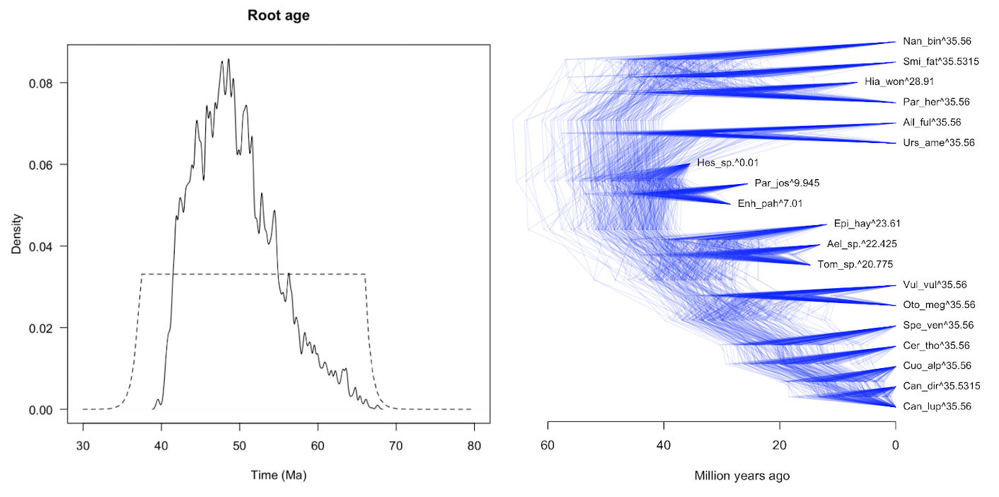
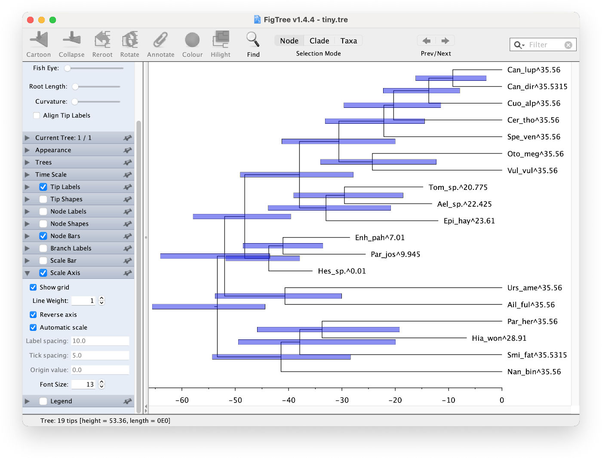
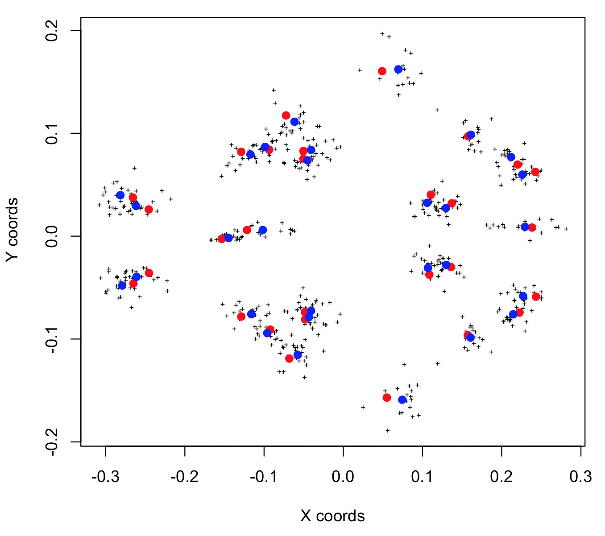

```{r setup, include = FALSE}
knitr::opts_chunk$set(
  collapse = TRUE,
  comment = "#>"
)
```

In this tutorial, we will use geometric morphometrics (GMM) and molecular data from extant and fossil carnivores for Bayesian inference of speciation timings. The tutorial reproduces the analysis detailed in the following paper:  

> **Bayesian estimation of species divergence times using correlated quantitative characters**\
> Álvarez-Carretero S, Goswami A, Yang Z, and dos Reis M. (2019) *Systematic Biology*, 68: 967--986.\
> [DOI: 10.1093/sysbio/syz015](https://doi.org/10.1093/sysbio/syz015)

The tutorial is divided into the following steps:  

1. Collect and process morphological data   
2. Perform Procrustes alignment of GMM data  
3. Transform a GMM alignment to account for population noise and character correlation
4. Carry out MCMC divergence dating with MCMCtree using GMM and molecular data  
5. Visualise and validate divergence dating results  
  
Before starting the tutorial, make sure you have the `mcmc3r` R package and its dependencies installed. Steps 4 and 5 require that you: (1) download and install the command line version of [MCMCTree from PAML](https://bit.ly/ziheng-paml) (make sure MCMCtree is in your system's PATH, as explained in PAML's website), and (2) download the [tree, alignment and control files](https://github.com/dosreislab/mcmc3r/tree/master/misc/carnivores) necessary to reproduce the analysis with MCMCtree, and save these files to a directory called `carnivores/`. This tutorial was tested with PAML version 4.9j, and thus we recommend you use this version when doing the tutorial excercises.

## 1. Collect and process morphological data

First, landmark measurements from the bones of extinct and extant taxa need to be collected. Here we use landmarks measured from the skulls of 19 carnivoran species.

If there is one species for which more than one specimen is available, we can use the various specimens to estimate the covariance matrix of landmarks, which can be used to account for population noise and caracter correlation before Bayesian inference. Here we use 21 specimens of *Vulpes vulpes* (common fox) for this purpose. Therefore, we have two data sets:  

* **The foxes (*Vulpes vulpes*) data set**: landmarks collected from 21 fox specimens.  
* **The carnivoran data set**: landmarks collected from 19 species (one specimen per species, with one fox specimen also present in the foxes data set).  

### Specimens information

The 19 carnivoran specimens are detailed in the next table. The oldest fossil species is _Hesperocyon sp._ dating to roughly 35.6 Millions years ago (Ma).


| Taxon<sup>**a**</sup>                          | Voucher specimen | Specimen age (mid-point age<sup>**b**</sup>), Ma | Reference<sup>**c**</sup>                                                                     |
|-----------------------------------------------|------------------|-------------------------------------------------|----------------------------------------------------------------------------------------------|
| *Hesperocyon sp.* †                             | NMNH 459576      | 35.5500 (37.2000-33.9000)                | National Museum of Natural History collection                                                |
| *Enhydrocyon pahinsintewakpa* †                 | AMNH 27579       | 28.5500 (30.800-26.3000)                 | Wang 1994, pp. 89-90                                                                         |
| *Paraenhydrocyon josephi* †                     | YPM 12702        | 25.6150 (30.8000-20.4300)                | Wang 1994, p. 135 & p. 141                                                                   |
| *Tomarctus hippophaga* †                        | AMNH 61156       | 14.7850 (15.9700-13.6000)                | Wang et al. 1999, pp. 157-158                                                                |
| *Aelurodon ferox* †                             | AMNH 61757       | 13.1350 (15.9700-10.3000)                | Wang et al. 1999, pp. 182-183                                                                |
| *Epicyon haydeni* †                             | LACM 131855      | 11.9500 (13.6000-10.3000)                | Wang et al. 1999, pp. 252-254                                                                |
| *Smilodon fatalis* †                            | LACMHC 1360      | 0.0285 (0.0440-0.0130)                   | La Brea Tar Pits collection                                                                  |
| *Hyaenictitherium wongii* †                     | China G L-49     | 6.6500 (8.0000-5.3000)                   | Werdelin 1988, p. 259; Werdelin & Solounias 1991, p. 33; Tseng & Wang 2007, p. 708 (Table 2) |
| *Canis dirus* †                                 | LACMHC 2300-4    | 0.0285 (0.0440-0.0130)                   | La Brea Tar Pits collection                                                                  |
| *Ursus americanus americanus* (O)               | FMNH 106356      | 0                                               | -                                                                                            |
| *Ailurus fulgens* (O)                           | FMNH 60762       | 0                                               | -                                                                                            |
| *Nandinia binotata* (O)                         | FMNH 149362      | 0                                               | -                                                                                            |
| *Paradoxurus hermaphroditus phillipinensis* (O) | FMNH 33548       | 0                                               | -                                                                                            |
| *Cuon alpinus primaevus*                        | FMNH 38515       | 0                                               | -                                                                                            |
| *Speothos venaticus*                            | FMNH 87861       | 0                                               | -                                                                                            |
| *Canis lupus lycaon*                            | FMNH 153800      | 0                                               | -                                                                                            |
| *Cerdocyon thous aquilis*                       | FMNH 68889       | 0                                               | -                                                                                            |
| *Otocyon megalotis*                             | AMNH 179143      | 0                                               | -                                                                                            |
| *Vulpes vulpes pusilla*                         | FMNH 112415      | 0                                               | -                                                                                            |                                                                                      |

<sub><sup>**a**</sup>The first nine species are extinct species (indicated by a dagger) and the next ten are extant species. Those with the label "(O)" are outgroups.</sub>  
<sub><sup>**b**</sup>Mid-point age calculated from the maximum and minimum ages of the voucher specimen according to the formation from which it was retrieved. See column with header "Reference" for the literature where the corresponding specimen and the formation from where it was collected are described.</sub>  
<sub><sup>**c**</sup>Age reference corresponding only to the fossil specimens (extinct species). This can refer to either a paper, book chapter, or the database for the museum collection.</sub> 
<sub><sup></sup></sub>  


### Landmark points

The 29 3D-landmarks collected from the specimen skulls are:

| Landmark # | Landmark description                                  |
|------------|-------------------------------------------------------|
| 1          | Basioccipital-Basisphenoid-Bulla suture - left        |
| 2          | Basioccipital-Basisphenoid-Bulla suture - right       |
| 3          | Palatine - Maxilla - ventral suture                   |
| 4          | Jugal - Squamosal ventral suture - left               |
| 5          | Jugal - Squamosal ventral suture - right              |
| 6          | Bulla - anterior extreme - left                       |
| 7          | Bulla - anterior extreme - right                      |
| 8          | Bulla - posterior lateral extreme - left              |
| 9          | Bulla - posterior lateral extreme - right             |
| 10         | Premaxilla - anterior extreme - left                  |
| 11         | Premaxilla - anterior extreme - right                 |
| 12         | Jugal-Maxilla (Orbit crest) suture - left             |
| 13         | Jugal-Maxilla (Orbit crest) suture - right            |
| 14         | Jugal-Maxilla (base of zygomatic arch) suture - left  |
| 15         | Jugal-Maxilla (base of zygomatic arch) suture - right |
| 16         | Nasals - Frontal suture                               |
| 17         | Anterior lateral M1 - left                            |
| 18         | Posterior lateral M2 - left                           |
| 19         | Anterior lateral M1 - right                           |
| 20         | Posterior lateral M2 - right                          |
| 21         | Canine - mesial extreme - left                        |
| 22         | Canine - mesial extreme - right                       |
| 23         | Postorbital process tip - left                        |
| 24         | Postorbital process tip - right                       |
| 25         | Paraoccipital process tip - left                      |
| 26         | Paraoccipital process tip - right                     |
| 27         | Parietals - Occipital suture                          |
| 28         | Occipital condyle - extreme - left                    |
| 29         | Occipital condyle - extreme - right                   |

The next figure shows a 2D projection of the landmarks. The crosses in orange are the landmarks from the 21 foxes, while the grey crosses are the landmarks from the rest of the 18 carnivoran specimens. The black dots correspond to the mean of the landmark coordinates across the 19 carnivoran species:  


<p align="center">
  
</p>

### Raw data

The landmarks can be collected in 2D (`x` and `y` coordinates per landmark) or 3D (`x`, `y`, and `z` coordinates per landmark). In this tutorial, we are using 29 3D landmarks.

#### A. Carnivores data set

1. Load the raw data. The raw landmark data can be found in the `inst/extdata` directory.  The command below will find and load the data into R:   

```{r}
filepath <- system.file( "extdata", "carnivores19x29.tsv", package = "mcmc3r")
carnivores19x29.raw <- read.table( file = filepath, header = F, skip = 1, dec = ".", sep = "\t" )
dim( carnivores19x29.raw )
```  

  * For example, the first nine columns of `carnivores19x29.raw` are:  

```{r, echo=FALSE, results='asis'}
knitr::kable(carnivores19x29.raw[,1:9])
```

  * The full table has 19 rows, one for each of the 19 specimens, and 89 columns, 2 columns with information about the specimens and 87 columns with the coordinates collected for the 29 3D-landmarks, i.e. $29\times3=87$ morphological traits.  

2. Note that this new object `carnivores19x29.raw` is not a matrix: it is a data.frame. We need an object of class matrix in order to perform a Procrustes analysis. Therefore, we only keep the columns with the morphological characters (columns 3-89). Furthermore, we use the first column, which contains the names of the specimens, as the names for the rows in the new matrix. This step is very important, as this is the only way we will be able to identify the landmarks with the corresponding specimen they were collected from.  

```{r, eval=FALSE}
# 1. Convert raw data into class matrix and add row names
C.mat              <- as.matrix( carnivores19x29.raw[ , 3:dim( carnivores19x29.raw )[2] ] )
row.names( C.mat ) <- carnivores19x29.raw[ ,1 ]
```


#### B. Foxes data set

1. Load the raw data. As mentioned before, you can find the raw data in the `inst/extdata` directory.    
```{r, eval=FALSE}
filepath <- system.file( "extdata", "vulpes21x29.tsv", package = "mcmc3r")
vulpes21x29.raw <- read.table( file = filepath, header = F, skip = 1, dec = ".", sep = "\t" )
dim( vulpes21x29.raw )
```  

   * The first nine columns of `vulpes21x29.raw` are:  

```{r, echo=FALSE, results='asis', eval=FALSE}
knitr::kable(vulpes21x29.raw[,1:9])
```

   * The full table has 21 rows, one for each of the 21 foxes specimens, and 88 columns, 1 column with the names of the specimens and 87 columns with the coordinates collected for the 29 3D-landmarks, i.e. $29\times3=87$.  

2. As before, we need to convert the foxes data frame into a matrix, paying attention to preserving the species names and row names:  

```{r, eval=FALSE}
V.mat <- as.matrix( vulpes21x29.raw[ , 2:dim( vulpes21x29.raw )[2] ] )
row.names( V.mat ) <- vulpes21x29.raw[ , 1 ]
```

Now, we have two objects of class matrix with the two processed data sets: `C.mat`, with 29 landmarks for 19 carnivore specimens, and `V.mat`, with 29 landmarks for 21 fox specimens. We can now continue with the Procrustes alignment!  

## 2. Procrustes alignment

We will use the R package `Morpho` to perform the Procrustes alignment. We choose this package because it allows alignment of the foxes landmarks to the mean Procrustes shape of the carnivores. This ensures that the morphological alignment with the foxes, which will be later used to correct for population variance, is oriented and aligned to the morpho space of the rest of the carnivores specimens. 

1. Use the `mcmc3r::matrix2array` function to convert the matrix objects previously generated into arrays. The array format is required to perform a Procrustes alignment with the package `Morpho`.  

```{r, eval=FALSE}
C.arr <- mcmc3r::matrix2array( X = C.mat, coords = 3 )
V.arr <- mcmc3r::matrix2array( X = V.mat, coords = 3 )
```  

2. Use `Morpho::procSym` to perform a Procrustes alignment with `C.arr`. This function aligns all carnivoran specimens, resulting in the morphological alignment saved in object `C.PS` ($19\times87$). Note we have symmetrical landmarks, that is, landmarks collected from the left and right sides of the skull, and thus we indicate these as "paired landmarks" during Procrustes alignment:   
 
```{r, eval=FALSE}
# Get right and left vectors with corresponding symmetric landmarks
right <- c( 11, 22, 13, 19, 15, 20, 24, 5, 7, 2, 9, 26, 29 )
left  <- c( 10, 21, 12, 17, 14, 18, 23, 4, 6, 1, 8, 25, 28 )
pairedLM <- cbind( left, right )
# Run Morpho::procSym
C.PS  <- Morpho::procSym( dataarray = C.arr,
                        pairedLM = pairedLM )
```

3. We had previously put in an array the 21 foxes specimens and they are in object `V.arr`. So now we remove from `V.arr` the rows with the common fox in the objects `C.arr` and `V.arr`. This is done to avoid having repeated data, as `C.PS` contains an alignment with the same fox in both data sets. The common fox is the first specimen, therefore this is the specimen we remove from the array.   

```{r, eval=FALSE}
V.arr.nov1 <- V.arr[,,-1]
```

4. Use the object of class `symproc` output by `Morpho::procSym`, `C.PS`, in the  `Morpho::align2procSym` function. Specifically, this function will use the mean shape of alignment `C.PS` as the morpho space to which the landmarks of the other 20 foxes will be aligned, resulting in alignment `V.PS.nov1` ($20\times87$).   

```{r, eval=FALSE}
V.PS.nov1             <- Morpho::align2procSym( x = C.PS, newdata = V.arr.nov1 )
# Add the species names as row names in V.PS.nov1
dimnames( V.PS.nov1 ) <- dimnames( V.arr.nov1 )
```

5. Get the vulpes (Vulpes_1) from `C.PS`, in position 13, and add it to `V.PS`. This includes the vulpes in the previous alignment.      

```{r, eval=FALSE}
V.PS              <- array( dim = c( 29, 3, 21 ) )
dimnames( V.PS )  <- list( paste( "lmk", seq( 1:29 ), sep="" ),
                                  c( "x", "y", "z" ),
                                  c( "Vulpes_1",
                                     dimnames( V.PS.nov1 )[[3]] ) )
V.PS[,,1]    <- C.PS$rotated[,,13] # Vulpes_1
V.PS[,,2:21] <- V.PS.nov1

```

We have finished the Procrustes analysis! Now we convert the aligned landmark arrays back into matrices, as we need to manipulate these matrices to correct for population noise and landmark correlations:
 
```{r, eval=FALSE}
C <- mcmc3r::array2matrix( X = C.PS$rotated, coords = 3 )
V <- mcmc3r::array2matrix( X = V.PS, coords = 3 )
```

Matrix `C` is the morphological alignment with the 19 carnivoran specimens, while  matrix `V` contains the fox-only morphological alignment. We can now correct for the population noise and the correlation among characters. We will see how to do this in the next step!

## 3. Correct `C` for population noise and trait correlation

We will use the fox-only matrix to estimating the population noise (or population variance) and the correlation matrix among landmarks, which is obtained using the shrinkage estimator from package `corpcor`.

1. Find population variance using object `V`.

```{r, eval=FALSE}
var.foxes <- diag( cov( V ) )
```

2. Use the function `corpcor::cor.shrink` to estimate the shrinkage correlation matrix, `R.sh`, using the object `V`. This function gurantees to find the optimum value of delta to estimate a correlation matrix that can be inverted: `R.sh`. 

```{r, eval=FALSE}
# Generate shrinkage correlation matrix, R.sh
R.sh <- corpcor::cor.shrink( V )
# Convert R.sh into class matrix
R.sh <- cbind( R.sh )
```

These two objects will be later used in the `mcmc3r::write.morpho` function to correct for population noise and trait correlation.

## 4. Bayesian inference of divergence times with MCMCtree

We will proceed with Bayesian MCMC sampling of divergence times, which requires using a program external to R, MCMCtree. First, we use function `mcmc3r::write.morpho` to write the Procrustes alignment into a phylip file suitable for analysis with MCMCtree. The function will take the estimates of the population noise and character correlations and apply these to the Procustes alignment to generate a new transformed alignment with independent columns and population variances normalised to one (see original paper for details). The parameters we are going to pass to this function are:

* **M**   
   This is the morphological alignment, object `C`, we have previously generated. Therefore, we would write `M = C` when setting this parameter in the function.   
* **filename**   
   This is the name that will be given to the output file with the morphological alignment. We have chosen `seqfile.aln`, but you can choose any name.   
* **c**   
   This is the argument that takes the population noise, The object passed can be of length 1, if all characters have the same variance, or a vector with the same length than the number of characters (each character has a specific variance). In this tutorial, we are using the latter, as we are passing the object `var.foxes` with the population variance for each character previously calculated.   
* **R**   
   The object passed to this parameter has to be a symmetric and positive definite matrix, thus allowing to calculate its inverse. Otherwise, the likelihood calculation cannot take place because it needs to use the inverse of the correlation matrix. We are using `R.sh`, the estimated shrinkage correlation matrix calculated in the previous step.   
* **method**   
   If a correlation matrix is passed to parameter `R`, this function can use either
the `method = "chol"`(Cholesky decomposition) or `method = "eigen"` (eigen decomposition) to obtain a matrix `A` such that $R^{-1}={A^{T}}{A}$. This matrix $\mathrm{A^{T}}$ is later used to transform the morphological data, `M`, to account for the correlation in this data set, so that the transformed characters in `Z`, $\mathrm{Z}=\mathrm{M}\mathrm{A^{T}}$, are independent.   
* **names**   
   Vector or list with the specimens names. In this tutorial, we use a character vector.   
* **ages**   
   Vector or list with the ages of the specimens. Make sure each age corresponds to the right specimen as it should be in the same order than in vector `names`. In this tutorial, we use a numeric vector. Note extant species should have age `0` while extinct species should have ages `> 0`.   
     
Before running the commands below, use the `setwd` command in R to set your working directory to the `carnivores/` directory you created earlier.

```{r, eval=FALSE}
# setwd("~/carnivores/") # use the right directory path
# Create a vector (although it can also be a list) with the specimens names
names <- c( "Ael_sp.", "Can_dir", "Epi_hay", "Hes_sp.",
            "Par_jos", "Tom_sp.", "Enh_pah", "Cuo_alp",
            "Spe_ven", "Can_lup", "Cer_tho", "Oto_meg",
            "Urs_ame", "Ail_ful", "Nan_bin", "Par_her",
            "Hia_won", "Smi_fat", "Vul_vul"           )
# Create a vector (although it can also be a list) with the ages of the specimens.
# Make sure each age corresponds to the right specimen as it should be in the same 
# order than in vector `names`
ages  <- list( sp1  = 13.135, sp2  =  0.0285, sp3  = 11.95,  sp4  = 35.55,
               sp5  = 25.615, sp6  = 14.785,  sp7  = 28.55,  sp8  =  0,
               sp9  =  0,     sp10 =  0,      sp11 =  0,     sp12 =  0,
               sp13 =  0,     sp14 =  0,      sp15 =  0,     sp16 =  0,
               sp17 =  6.65,  sp18 =  0.0285, sp19 =  0 )

# Run write.morpho to correct for population noise and trait correlation and write the
# morphological alignment in MCMCtree format
mcmc3r::write.morpho( M = C, filename = "seqfile.aln", c = var.foxes , R = R.sh, method = "chol", names = names, ages = ages )
```

You can find more information and other examples in `?mcmc3r::write.morpho`. A bit of file `seqfile.aln`, which follows the PHYLIP format, is shown below:

```
  19  87  M  1  -17.4449361406561

Ael_sp.^22.425      32.1888806478969 13.2166043633248 18.0769785490827  ...
Can_dir^35.5315     28.6903520919794 11.7957141425012 10.6673624273699  ...
Epi_hay^23.61       30.7230881245987 13.8673453218744 3.30535244654374  ...
Hes_sp.^0.01        29.6257424752038 4.39441803218726 12.7003750739771  ...
Par_jos^9.945       26.8972062403083 16.3244194778594 9.66291130048758  ...
Tom_sp.^20.775      27.5960709958697 13.2198776170147 6.19263005366892  ...
Enh_pah^7.01        29.1449154123494 8.81885279314611 13.2404534560068  ...
Cuo_alp^35.56       25.9516979794982 12.9776718002656 11.2662021565935  ...
...
```

The first line has the number of species (19), the number of characters (87), a string indicating this is a morphological alignment (M), the standardised population noise (1) and the log-determinant of the correlation matrix (-17.44). This is then followed by the species names and transformed landmark coordinates. Note the species ages have been recoded. Do not worry about this.

The next step is to merge the morphological alignment (which contains extant and extinct species) with a molecular alignment (that only contains extant species). We have already prepared such combined file, which you should have already downloaded from [GitHub](https://github.com/dosreislab/mcmc3r/tree/master/misc/carnivores). Go to the `carnivores/` directory you created to store the data. There you will see file `morph_mol.aln`, containing the morphological and molecular alignments as two separate partitions. You can use a text editor to open the file. The top block is the morphological alignment, like the one shown above (although you may see some small numerical differences due to recent updates to the Procrustes algorithm). The bottom block is the molecular alignment of 3rd positions for mitochondrial genes.

File `mcmctree.ctl` contains the instructions required by MCMCtree to carry out MCMC sampling of divergence times. You can open this file with a text editor:

```
          seed = -1
       seqfile = morph_mol.aln
      treefile = carnivores.tree
      mcmcfile = mcmc.txt
       outfile = out.txt

         ndata = 2
       seqtype = 0    * 0: nucleotides; 1:codons; 2:AAs
       usedata = 1    * 0: no data; 1:seq like; 2:use in.BV; 3: out.BV
         clock = 2    * 1: global clock; 2: independent rates; 3: correlated rates
       RootAge = 'B(37.3, 66.0, 0.025, 0.025)'
       TipDate = 1 1  * TipDate (1) & time unit

         model = 0    * 0:JC69, 1:K80, 2:F81, 3:F84, 4:HKY85
         alpha = 0.5  * alpha for gamma rates at sites
         ncatG = 5    * No. categories in discrete gamma

     cleandata = 0    * remove sites with ambiguity data (1:yes, 0:no)?

       BDparas = 1 1 0 0.001 * birth, death, sampling
   alpha_gamma = 1 1         * gamma prior for alpha

   rgene_gamma = 2 10  * gamma prior for overall rates for genes
  sigma2_gamma = 2 2   * gamma prior for sigma^2 (for clock=2 or 3)

         print = 2
        burnin = 500
      sampfreq = 1 
       nsample = 8000
```

The first line, `seed = -1` tells the program to use a random seed to initialise the stochastic sampler. Then we have the names of the data files required by the program: the alignment, `morph_mol.aln`, and the phylogeny, `carnivores.tree`. Then the names of the output files: the raw mcmc output `mcmc.txt`, and the processed output `out.txt`. The next line, `ndata = 2` tells the program our alignment has two partitions. Then `seqtype = 0` which indicates DNA alignments for the non-morpho partitions, and `usedata = 1` which tells the program to use exact likelihood calculation (you can see a full description of all options in the MCMCtree manual). Then `clock = 2` tells the program to use the independent-log normal relaxed-clock model. Line `Root age` is a fossil calibration on the root (always required with MCMCtree). The next line, `TipDate = 1 1` activates tip dating (i.e. our fossil taxa are dated tips), with a time unit of 1 My. Then `model = 0` tells MCMCtree to use the JC69 model for the moleculr partition. We choose this model here because it is very fast to compute. In the original paper, we used HKY. We then have the prior for alpha, for the discrete gamma model, `alpha_gamma = 1 1`. Then we have the priors for the relaxed clock model, `rgene_gamma = 2 10`, and `sigma2_gamma = 2 2`. The last set of parameters control the amount of burn-in, `burnin = 500`, how often to collect samples from the MCMC, `sampfreq = 1`, and the total number of samples to collect, `nsample = 8000`.

Using the command line, go to your `carnivores/` directory and type the following
command:

```
mcmctree mcmctree.ctl
```

Then, please press enter to execute MCMCtree. The program will then start MCMC sampling of divergences times using the morphological and molecular data. If the command above fails, either you do not have MCMCtree installed, you have a different alias to execute the program, or your MCMCtree executable is not in your [system's search path](http://abacus.gene.ucl.ac.uk/software/paml.html). It should take around 8 minutes for the analysis to complete depending on the computer.

## 5. Visualise and validate divergence dating results

Once the MCMC sampling completes, you will see several files have been created. File `out.txt` contains dated trees and summary statistics of the MCMC. Open this file with a text editor and examine it. You should find the block with the dated trees, which like this:

```
Species tree for FigTree.  Branch lengths = posterior mean times; 95% CIs = labels
(((((((((1_Can_lup^35.56, 2_Can_dir^35.5315) 28 , 3_Cuo_alp^35.56) 27 , 4_Cer_tho^35.56) ...

(((((((((Can_lup^35.56: 7.399885, Can_dir^35.5315: 7.371385): 3.383741, Cuo_alp^35.56: ... 

(((((((((Can_lup^35.56 #1.000000: 7.399885, Can_dir^35.5315: 7.371385) [&95%HPD={0.711672, ...

rategram locus 1:
(((((((((Can_lup^35.56: 0.982196, Can_dir^35.5315: 0.893678): 0.254008, Cuo_alp^35.56: ...

rategram locus 2:
(((((((((Can_lup^35.56: 0.009285, Can_dir^35.5315: 0.009505): 0.016383, Cuo_alp^35.56: ...
```

The first tree has nodes labelled with numbers. Tips are labelled from 1 to 19 (as we have 19 species), and internal nodes are labelled from 20 (the root) to 37. Next, we have the timetree without the 95% CI, and next the same timetree but with the 95% CI of node ages, suitable for plotting with FigTree. The next two trees (rategrams) have branch lengths equal to the evolutionary rate for the branch, the first with the morphological rates for the landmark partition, and the second with the molecular rates for the molecular alignment.

If you scroll towards the bottom of the file, you will see a summary of the node ages (e.g., `t_n20`), rate parameters (`mu1`, `mu2`, `sigma1`, `sigma2`), and branch rates (e.g., `r_g1_n1`). For example, the posterior mean age of the root and its 95% credibility intervals (equal-tail and HPD) are:

```
t_n20         49.5139 (41.5294, 61.8787) (40.7484, 60.0179)
```

Note the values in your `out.txt` file may look different as MCMC uses random sampling to estimate parameters in the posterior distribution.

File `mcmc.txt`, which contains the raw MCMC output, can be loaded into R (remember you must have your working directory set to `carnivores/`):

```{r, eval=FALSE}
# Modify the path below to the right directory in your file system
# setwd("~/carnivores/")
# Load the MCMC file
mcmc <- read.table( file = "mcmc.txt", header = TRUE )
# Create a density plot for the root's age...
plot( density( mcmc$t_n20, adj = .2 ), xlim = c(30, 80),
      main = "Root age", xlab = "Time (Ma)", las = 1 )
# ... and we can compare the posterior to the prior calibration,
# 'B(37.3, 66.0, 0.025, 0.025)':
curve( mcmc3r::dB( x = x, tL = 37.3, tU = 66, pL = .025, pU = .025),
       add = TRUE, lty = 2 )
```

File `mcmc.txt` is suitable for performing diagnostics for convergence of the MCMC. For example, if you have the `coda` package installed, you can check for the effective sample sizes (ESS) of the parameters estimated. In our case many ESS will be small as we ran a rather short MCMC:

```{r, eval=FALSE}
coda::effectiveSize( x = mcmc[,-1] )
```

Alternatively, you can load `mcmc.txt` into Tracer (from the Beast MCMC software family) and perform convergence diagnostics there. We can also use the information within `mcmc.txt` to make a densitree plot in R:

```{r, eval=FALSE}
# Read tree used by MCMCtree for sampling:
tt <- ape::read.tree( file = "carnivores.tree" )
# Recode the tip ages for plotting:
tips_info <- strsplit(tt$tip.label, "\\^")
back.ages <- as.numeric(unlist(tips_info)[seq(from=2, to=2*19, by=2)])
back.ages <- max( back.ages ) - back.ages
# Plot the densitree (note this command may be slow):
mcmc3r::mcmc2densitree( tree = tt, mcmc = mcmc, time.name = "t_", 
                        thin = 0.025, alpha = 0.1, tip.ages = back.ages,
                        cex = .8, pfrac = .2 )
title( xlab = "Million years ago" )
```

<p align="center">
  
</p>

MCMCtree also generated a `FigTree.tre` file suitable for plotting the timetree with [FigTree](http://tree.bio.ed.ac.uk/software/figtree/). Note there is currently a bug in MCMCtree which adds a `#1.000000` or `#2.000000` within the tree in the `FigTree.tre` file. These tags must be removed, using a text editor, before loading the file into FigTree.

<p align="center">
  
</p>

Finally, we can use the MCMC sample from MCMCtree to generate ancestral reconstructions of the landmarks for all nodes in the phylogeny.

```{r, eval=FALSE}
# First, we need to make sure the taxa names in object `C` match exactly
# those in the tree (which are slightly different as they contain the taxa ages)
i <- pmatch( rownames( C ), tt$tip.label )
rownames( C ) <- tt$tip.label[i]
recM <- mcmc2anc( tree = tt, M = C, mcmc = mcmc, time.name = "t_",
                  rate.name = "r_g1_", tip.ages = back.ages)

x <- seq( from = 1, to = 87, by = 3 )
y <- seq( from = 2, to = 87, by = 3 )
# Plot landmarks for the 19 carnivores:
plot( x = C[,x], y = C[,y], pch = '+', cex = .5,
      xlab = "X coords", ylab = " Y coords" )

# Plot ancestral reconstruction at the root (node 20):
points( x = recM["20",x], y = recM["20",y], pch = 19, col = "red" )

# Calculate and plot mean shape
mS <- apply( X = C, MARGIN = 2, FUN = mean )
points( x = mS[x], y = mS[y], pch = 19, col = "blue" )
```

<p align="center">
  
</p>

The reconstruction is stored as a matrix object. We can convert it to an array for compatibility with morphometrics software. You can also use array objects to generate 3D plots with the rgl package.

```{r, eval=FALSE}
recA <- mcmc3r::matrix2array( X = recM, coords = 3 )
options( rgl.printRglwidget = TRUE )
rgl::plot3d( recA[,,"20"], ty = 's', size = 2, col = "red", aspect = FALSE )
```

We hope this tutorial has been useful and you have managed to reproduce the results from the paper!

<hr>

### EXERCISES

Now, some additional exercises you can play with:

**Exercise 1:**\
Because the MCMCtree is stochastic, there is no guarantee that the MCMC sample has converged to the posterior distribution. Rename files `mcmc.txt` and `out.txt` as `mcmc1.txt` and `out2.txt` respectively. Then run `mcmctree` again. Rename the newly generated files as `mcmc2.txt` and `out2.txt`. Now compare the two sets of files. For example, you can look at the posterior means and 95% CIs at the end of the `out1.txt` and `out2.txt` files, or you can plot the densities of the node age samples in R. Do the results look similar? If not, then the MCMC samples have not converged.

<br>

**Exercise 2:**\
The MCMC above was rather short, and it is unlikely that the values converged. Open file `mcmctree.ctl` and change the following lines as shown here: `burnin = 5000`, `sampfreq = 50`, `nsample = 20000`. Then run MCMCtree again. This new analysis will take much longer, over 15 hours, which is normal in phylogenetic MCMC sampling. If you create two directories in your computer, you can run two analyses in parallel overnight. The next day look at the results in the `out.txt` files. The results should now be much more similar, indicating convergence.

<br><br>

